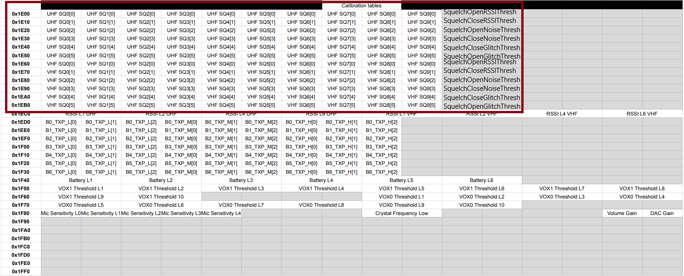

# Quansheng-UV-Calibrations

An attempt to improve radio sensitivity by modifying the values stored in the EEPROM.

The squelch level values in the files have been modified.

k5prog is recommended for uploading.

MAKE A BACKUP BEFORE DOING THIS!!

Use this calibration files ENTIRELY at your own risk. This files is totally experimental!!

